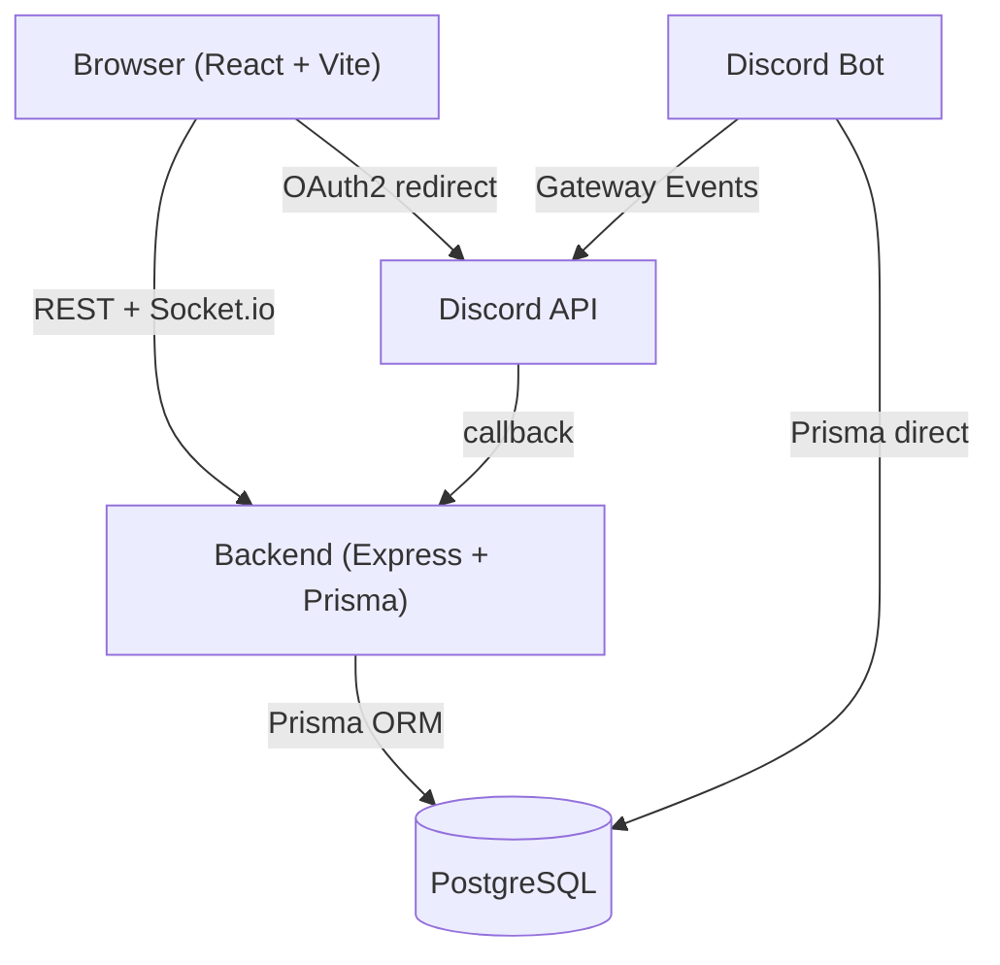

# TomManager

Application web de gestion d'evenements JDR (jeux de role et jeux de societe) avec planning collaboratif, inventaire de jeux et acces par roles Discord.

## Stack

| Couche          | Technologies                                              |
| --------------- | --------------------------------------------------------- |
| Frontend        | React 18, TypeScript, Vite, TailwindCSS, DaisyUI          |
| Backend         | Node.js, Express, TypeScript, Prisma ORM                  |
| Base de donnees | PostgreSQL 15                                             |
| Real-time       | Socket.io                                                 |
| Auth            | Sessions express + Discord OAuth2                         |
| Infra           | Docker, GitHub Actions, Portainer, Traefik, Let's Encrypt |

## Fonctionnalites

- **Evenements** : creation et gestion par les admins, inscription des membres
- **Planning collaboratif** : tables de jeu avec creneaux, tags, GM, participants
- **Inventaire de jeux** : recherche et import depuis BoardGameGeek, fiches completes (image, description, stats), jeux apportes par evenement
- **Auth Discord** : connexion via Discord (mode de connexion unique dans l'interface), surnom serveur affiche, acces automatique par role de serveur
- **Droits d'administration a la carte** : chaque admin active/desactive individuellement ses droits (evenements, tables, jeux) depuis son profil
- **Notifications temps reel** : via Socket.io
- **Bot Discord** : sync automatique des participations lors des changements de role
- **Participants** : liste avec tri (nom, date, role) et filtre (admins / membres)

## Architecture



## Prerequis

- [Docker](https://docs.docker.com/get-docker/) et Docker Compose
- Node.js 20+ (pour les scripts locaux, Playwright, etc.)
- Une application Discord ([Discord Developer Portal](https://discord.com/developers/applications)) avec un bot invite sur le serveur

## Installation

```bash
# 1. Cloner le depot
git clone <repo-url>
cd TomManager

# 2. Configurer les variables d'environnement
cp .env.example .env
# Editer .env avec vos valeurs (voir section Variables d'environnement)

# 3. Demarrer l'application
npm run docker:up:build
```

L'application est disponible sur `http://localhost:3000`.

## Variables d'environnement

| Variable                | Description                                                    | Requis |
| ----------------------- | -------------------------------------------------------------- | ------ |
| `POSTGRES_USER`         | Utilisateur PostgreSQL                                         | Oui    |
| `POSTGRES_PASSWORD`     | Mot de passe PostgreSQL                                        | Oui    |
| `POSTGRES_DB`           | Nom de la base de donnees                                      | Oui    |
| `SESSION_SECRET`        | Secret de session (min. 32 caracteres)                         | Oui    |
| `CORS_ORIGIN`           | URL du frontend (ex: `http://localhost:3000`)                  | Oui    |
| `VITE_BACKEND_URL`      | URL du backend depuis le navigateur                            | Oui    |
| `DISCORD_CLIENT_ID`     | Client ID de l'app Discord                                     | Non    |
| `DISCORD_CLIENT_SECRET` | Client Secret de l'app Discord                                 | Non    |
| `DISCORD_GUILD_ID`      | ID du serveur Discord                                          | Non    |
| `DISCORD_REDIRECT_URI`  | URI de callback OAuth2                                         | Non    |
| `DISCORD_BOT_TOKEN`     | Token du bot Discord                                           | Non    |
| `DISCORD_ADMIN_ROLE_ID` | ID du role Discord donnant les droits ADMIN (optionnel)        | Non    |
| `BGG_API_TOKEN`         | Token Bearer BoardGameGeek (recherche BGG desactivee sans lui) | Non    |
| `SENTRY_DSN`            | DSN Sentry pour le tracking d'erreurs backend                  | Non    |
| `VITE_SENTRY_DSN`       | DSN Sentry pour le tracking d'erreurs frontend                 | Non    |

> Discord est le seul mode de connexion disponible dans l'interface. Si les variables Discord ne sont pas configurees, la connexion est indisponible pour les utilisateurs (l'endpoint API `/api/auth/login` existe encore mais n'est plus accessible depuis l'UI).

## Commandes

```bash
# Developpement
npm run docker:up:build     # Demarrer (build + start)
npm run docker:up:d         # Demarrer en arriere-plan
npm run docker:down         # Arreter
npm run docker:logs         # Voir les logs en temps reel
npm run docker:clean        # Tout supprimer (conteneurs + volumes)

# Base de donnees
npm run prisma:migrate      # Appliquer les migrations
npm run prisma:studio       # Ouvrir Prisma Studio (port 5555)

# Tests
npm test                    # Backend + Frontend
npm run test:backend        # Backend seul
npm run test:frontend       # Frontend seul
npm run test:e2e            # Tests E2E Playwright (app doit tourner)
npm run test:e2e:ui         # Tests E2E avec UI Playwright

# Qualite de code
npm run format              # Formater le code (Prettier)
npm run format:check        # Verifier le formatage
```

## Structure du projet

```
TomManager/
├── backend/          # API Express + TypeScript
│   ├── prisma/       # Schema et migrations
│   └── src/
│       ├── controllers/
│       ├── services/
│       ├── routes/
│       ├── middleware/
│       └── __tests__/
├── frontend/         # React + TypeScript + Vite
│   └── src/
│       ├── components/
│       ├── pages/
│       ├── hooks/
│       ├── contexts/
│       └── __tests__/
├── discord-bot/      # Bot Discord (sync roles en temps reel)
├── e2e/              # Tests Playwright
└── docs/             # Specifications et documentation
```

## Configuration Discord (optionnelle)

1. Creer une application sur [Discord Developer Portal](https://discord.com/developers/applications)
2. Dans l'onglet **OAuth2**, ajouter l'URI de redirection : `<BACKEND_URL>/api/auth/discord/callback`
3. Dans l'onglet **Bot**, creer un bot et activer **Server Members Intent** (Privileged Gateway Intents)
4. Inviter le bot sur le serveur avec la permission minimale `bot`
5. Renseigner les variables `DISCORD_*` dans `.env`
6. Associer un role Discord a un evenement via le champ "Discord Role ID" dans l'interface admin

## Tests

Le projet inclut 3 niveaux de tests :

- **Tests unitaires** (Vitest) : logique metier, services, composants
- **Tests d'integration** (Vitest + Supertest) : routes API avec base de donnees de test
- **Tests E2E** (Playwright) : flux utilisateur complets sur Chromium et Chrome mobile

Les tests tournent automatiquement en CI (GitHub Actions) a chaque push et bloquent le deploiement en cas d'echec.
